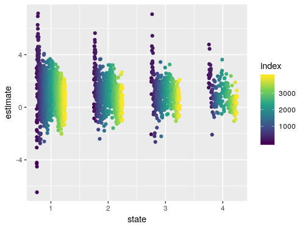

# Bayesian Regression on the corridor environment

The past day I've been playing around with the corridor environment to try to figure out why the bayesian method doesn't work on the corridor environment.

## Visualization of the Q-values

The plot below is of the sampled Q-values for the action 1, which is the action that leads to the end of the corridor. The values are only saved when this is the action that is chosen. This means a point represents the value of the action when it was chosen. The values are ploted for state 1, 2, 3 and 4. The color and offset represent when in the training process the value was sampled.

The state 4 values indicate that the method has managed to reach the end of the corridor. The mean for this value seems reasonable but given the abundunce of points here one would expect the variance to head towards 0. There is some reduction in variance intially but this steems to stagnate and running the experiment for longer does not seem to decrease this further.

The result of this is that the agent is not able to learn a policy that consistently reaches the final state.

I originally thought that the prior might be having too much influence on the posterior. Howerer this did not fit what I saw with the simple posterior examples. A low variance target can be hard to fit but the variance in the plot above is much larger than what the model was capable in the simple example.

In addition the method works well on cartpole and acrobot which I think both have relatively low variance targets.

## Uncertainty versus Noise

I started looking into ways of reducing the influence of the prior without much luck since this doesn't really make sense. However looking through the formulas I remembered that $\sigma_\varepsilon$ is constant across states for each action. All our uncertainty ends up in this noise term since $\Sigma_\beta$ constantly decreases with new data. This means all the uncertainty is forced into a parameter that can't change by state.

I haven't been able to test that this is 100% why the corridor example fails but it does fit with the problems we are seeing.

For the corridor environment the agent can get either hope for 0 or 1 reward when moving towards the end of the corridor. If it is has reached the final state before reaching the end of the corridor it is garantueed to get 1 reward given the right action. However, inorder to encorparate the uncertainty for the 0 or 1 reward for earlier states it has to have a large variance term in the noise, so the agent cannot represent the final state as a garantueed return of 1. This results in the high variance state 4.

This also explains why cartpole and acrobot seem to work. I think these environment have constant variance in the environment.

## What to do about it

1. Somehow change the bayesian regression to update $\Sigma_\beta$ to encorporate the uncertainty in the target.
2. Allow for noise that is dependent on the state (hetereoscedasticity).

I'll look into if either of these are realistically possible given the time left. Let me know if you have any immediate thoughts or disagree with the above.