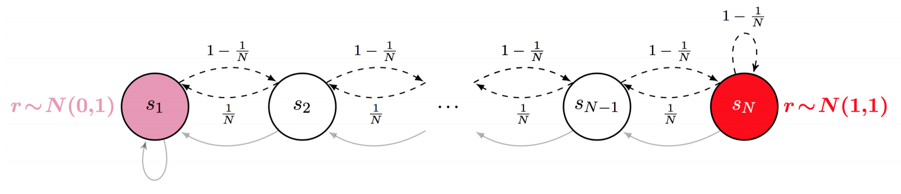

## Corridor

This environment is a generalization of an environment called riverswim.

The corridor environment allows one to define:

* **N:** The environment consists of a N long corridor where the agent can move
  left or right.
* **K:** in a K number of states, the direction traveled when given is the
  opposite of the expected. I.e. action left will cause the agent to move right.
* **p:** Probability of success when moving right. 1-**p** probability of moving left
  instead.